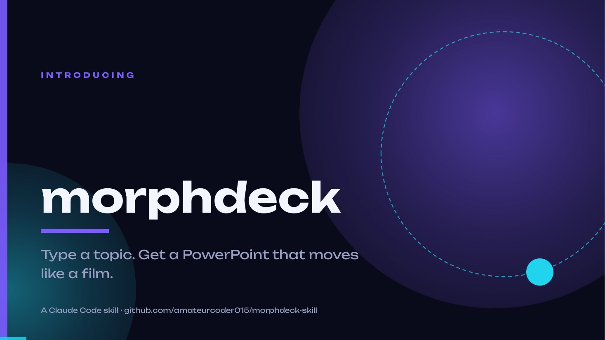
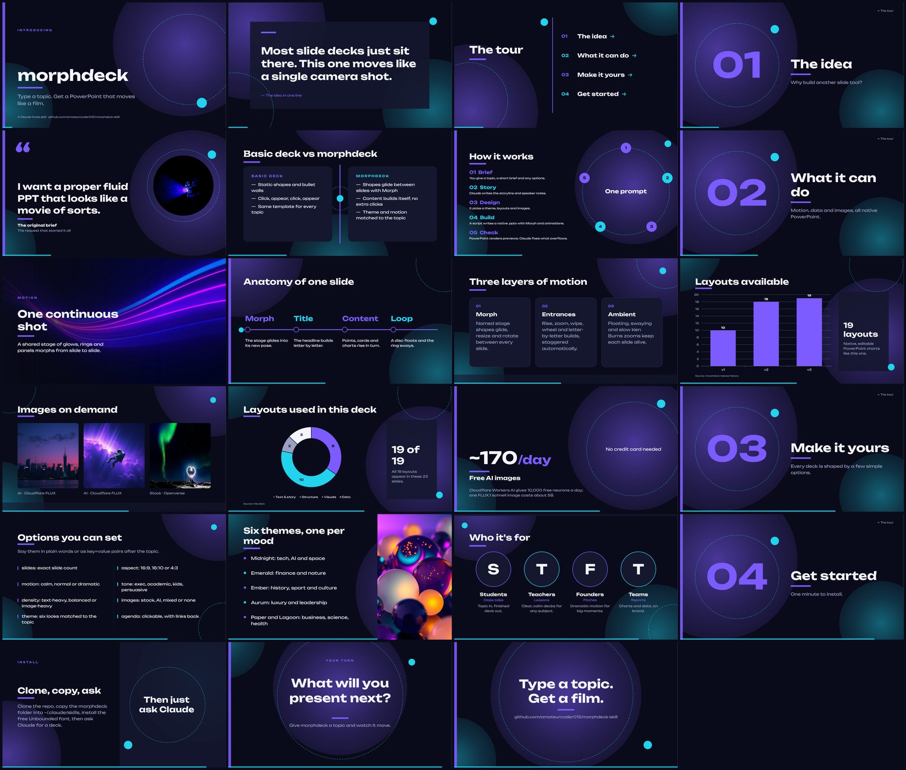
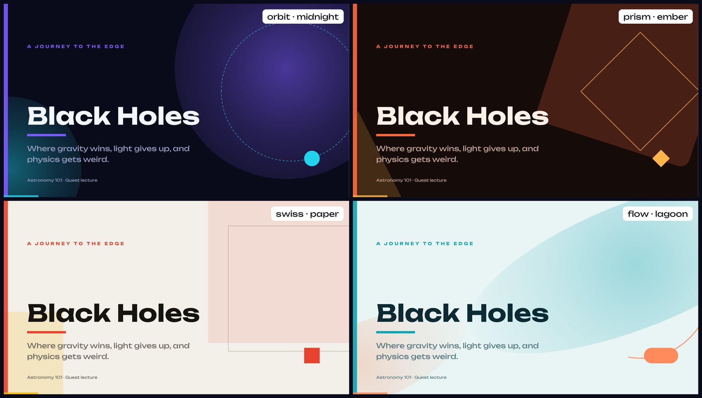
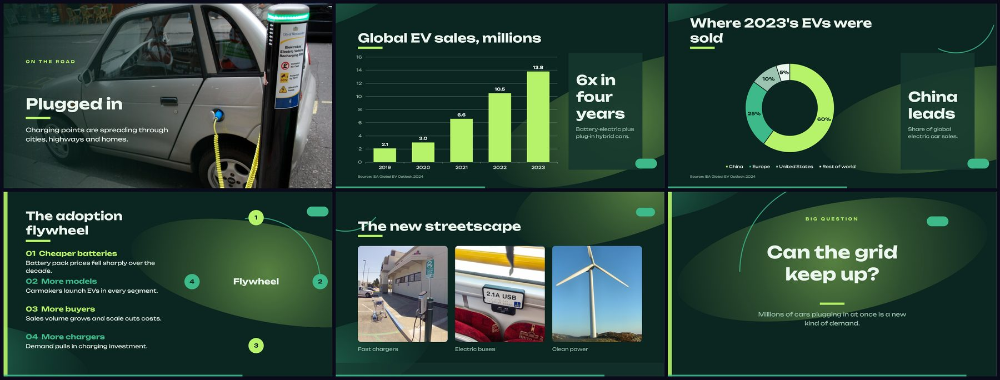
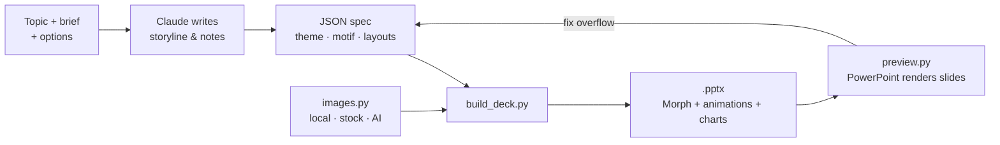

<div align="center">



# morphdeck

### Type a topic. Get a PowerPoint that moves like a film.

A [Claude Code](https://claude.com/claude-code) skill that turns a title, or a title plus a short brief, into a **native `.pptx`** with Morph transitions, auto-playing animations, animated charts and free AI images. Not a template: a story, designed and animated for your topic.


[**▶ Download the showcase deck**](decks/morphdeck-showcase.pptx?raw=1) · [Quick start](#-quick-start) · [Options](#%EF%B8%8F-options) · [Layouts](#-layouts) · [AI images](#-images-your-own-stock-or-free-ai) · [How it works](#-how-it-works)

</div>

---

## ✨ What you get

| | |
|---|---|
| 🎞 **Morph on every slide** | A shared "stage" of shapes glides, resizes and turns between slides, so the deck plays as one continuous camera move. |
| ⚡ **Animations that run themselves** | Titles build letter by letter, statements word by word, and points, cards and charts rise in turn. No extra clicks. |
| 🌊 **Ambient motion** | Floating accents, a swaying ring and slow Ken Burns zooms on photos keep every slide alive. |
| 📊 **Animated native charts** | Column, bar, line, area, stacked, donut and pie charts in theme colours. The data stays editable in PowerPoint. |
| 🖼 **Images on demand** | Your own files, links, automatic stock photos, or **free AI images** from Cloudflare FLUX, with credits added to the speaker notes. |
| 🔗 **Clickable agenda** | Agenda items jump to their sections, and each section jumps back, with Morph playing on every jump. |
| 🎨 **6 themes × 4 motifs** | Colour themes matched to the topic, combined with four shape languages for the moving stage. |
| 🎛 **Your knobs** | Slide count, motion intensity, text-heavy vs image-heavy, tone, aspect ratio, brand colours. |
| 🗣 **Speaker notes** | Talking points written in your chosen tone, ready in the presenter view. |
| ✏️ **Fully editable** | Real PowerPoint objects. Retime anything in the Animation Pane, rename layers in the Selection Pane. |

---

## 🎬 See it

**The showcase deck**: 23 slides that use all 19 layouts, made by morphdeck about morphdeck. [Download it](decks/morphdeck-showcase.pptx?raw=1) and press **⌘⇧↩** (Mac) or **F5** (Windows).



**Four motifs, one deck.** The same content in each shape language:



**Charts, photos and diagrams** from the electric-vehicles example:



### Example decks in this repo

| Deck | Theme · motif | Shows off |
|---|---|---|
| [morphdeck-showcase.pptx](decks/morphdeck-showcase.pptx?raw=1) | midnight · orbit, dramatic | every layout, AI images, charts, clickable agenda |
| [electric-vehicles.pptx](decks/electric-vehicles.pptx?raw=1) | emerald · flow, dramatic | real data charts, stock photos, process diagram |
| [black-holes-orbit.pptx](decks/black-holes-orbit.pptx?raw=1) | midnight · orbit | the classic look |
| [black-holes-prism.pptx](decks/black-holes-prism.pptx?raw=1) | ember · prism | Bauhaus geometry |
| [black-holes-swiss.pptx](decks/black-holes-swiss.pptx?raw=1) | paper · swiss | light editorial style |
| [black-holes-flow.pptx](decks/black-holes-flow.pptx?raw=1) | lagoon · flow, calm, 4:3 | calm motion, 4:3 format |

> Static previews can't show the motion. Open a deck in PowerPoint and play it.

---

## 🚀 Quick start

```bash
git clone https://github.com/amateurcoder015/morphdeck-skill.git
cd morphdeck-skill
./install.sh
```

The installer:
1. copies the skill to `~/.claude/skills/morphdeck` (use `./install.sh --link` to symlink instead),
2. installs the Python packages (`python-pptx`, `pillow`, `certifi`, plus `pymupdf` on macOS for previews),
3. **installs the bundled Unbounded font** for your user,
4. creates `~/.config/morphdeck/.env` for optional API keys.

Restart Claude Code, then:

```
/morphdeck Black holes
```

<details>
<summary><b>Windows or manual install</b></summary>

```powershell
git clone https://github.com/amateurcoder015/morphdeck-skill.git
xcopy /E /I morphdeck-skill\morphdeck %USERPROFILE%\.claude\skills\morphdeck
python -m pip install --user python-pptx pillow certifi
python %USERPROFILE%\.claude\skills\morphdeck\scripts\fonts.py
```

`fonts.py` installs Unbounded for the current user on macOS, Windows and Linux. The deck builder also runs it automatically before each build, so the font is in place whenever you generate a deck.
</details>

---

## 🧑‍💻 How to use it

Ask in plain words, or use the slash command with optional `key=value` options:

```
/morphdeck Photosynthesis
```
```
/morphdeck The 2008 financial crisis for a college econ class: causes, the Lehman collapse, what changed after. 10 slides.
```
```
/morphdeck Our Q3 results slides=8 motion=calm tone=exec theme=paper motif=swiss brand=#0052FF
```
```
/morphdeck Cities of 2050 density=visual images=ai motion=dramatic
```

Claude then:

1. **Writes the story**: hook, sections, a turning point and a closing line, plus speaker notes.
2. **Designs it**: picks a theme, a motif and a layout for each slide, never repeating a layout back to back.
3. **Finds images**: stock or AI, depending on your choice.
4. **Builds** the `.pptx` with Morph, animations and charts.
5. **Checks it**: on a Mac with PowerPoint, it renders every slide, looks for overflow or collisions, and fixes them.
6. **Hands it over** with a list of the choices it made.

---

## 🎛️ Options

| Option | Values | Default |
|---|---|---|
| `slides` | any number | 8–12, depending on the topic |
| `theme` | `midnight` `emerald` `ember` `aurum` `paper` `lagoon` | matched to the topic |
| `motif` | `orbit` `prism` `swiss` `flow` | the theme's motif |
| `motion` | `calm` `normal` `dramatic` | `normal` |
| `density` | `text` (content-heavy) · `balanced` · `visual` (image-heavy) | `balanced` |
| `images` | `stock` `ai` `mixed` `none`, or your own files and links | `stock` when photos help |
| `tone` | `exec` `academic` `kids` `casual` `persuasive` … | inferred |
| `aspect` | `16:9` `16:10` `4:3` | `16:9` |
| `agenda` | `yes` `no` (a clickable agenda) | `yes` for longer decks |
| `brand` | hex colours | theme colours |

<details>
<summary><b>What <code>motion</code> changes</b></summary>

| | calm | normal | dramatic |
|---|---|---|---|
| Morph speed | slower | standard | faster |
| Stagger between items | wide | standard | tight |
| Rise distance / zoom depth | small | medium | large |
| Letter-by-letter titles | off | on | on |
| Stage spin per slide | 35° | 70° | 140° |
| Ken Burns push-in | 4% | 8% | 15% |
</details>

<details>
<summary><b>What <code>density</code> changes</b></summary>

| | text | balanced | visual |
|---|---|---|---|
| Slides with images | ≤ 25% | 15–55% | ≥ 50% |
| Words per slide | ≤ 70 | ≤ 45 | ≤ 25 |
| Favourite layouts | detail, bullets, cards, compare, chart | a mix | image, gallery, split, quote, stat |

Each build prints the deck's actual image share and words per slide, and warns if they drift from the requested density.
</details>

---

## 🎨 Themes and motifs

**Themes** set the colours:

| Theme | Look | Good for |
|---|---|---|
| `midnight` | navy, violet, cyan | tech, AI, space, the future |
| `emerald` | deep green, lime | finance, sustainability, nature |
| `ember` | warm black, orange, amber | history, energy, sport, culture |
| `aurum` | black and gold | luxury, leadership, law |
| `paper` | warm off-white, red, yellow | business, education, research |
| `lagoon` | pale teal, coral | health, science, wellbeing |

**Motifs** set the shapes that morph across the deck. Any theme works with any motif:

| Motif | Shapes | Feels |
|---|---|---|
| `orbit` | glowing orbs, a dashed ring, a dot | cosmic, techy |
| `prism` | tilted squares, triangles, a turning diamond | bold, Bauhaus |
| `swiss` | flat colour blocks, hairline frames | editorial, corporate |
| `flow` | ribbon glows, an open arc, a pill | organic, calm |

---

## 🧩 Layouts

| Story | Data | Visual | Structure |
|---|---|---|---|
| `title` | `stat` | `image` (full-bleed) | `agenda` (clickable) |
| `statement` | `chart` | `gallery` | `section` |
| `question` | `compare` | `split` (photo or aside) | `timeline` |
| `quote` (with photo) | `cards` | `people` (photos or initials) | `process` (cycle) |
| `closing` | `detail` (content-heavy) | `bullets` (with photo) | |

The fields for every layout are in [`morphdeck/references/spec.md`](morphdeck/references/spec.md).

---

## 🖼 Images: your own, stock or free AI

Any image field accepts:

| Value | Source |
|---|---|
| `"photos/team.jpg"` | a local file |
| `"https://…/pic.jpg"` | a link, downloaded once |
| `"stock:wind turbines at sunset"` | stock photo search via [Openverse](https://openverse.org) (free, no key), or [Pexels](https://www.pexels.com/api/) if `PEXELS_API_KEY` is set |
| `"ai:glowing city skyline at dusk, cinematic"` | **AI-generated** with Cloudflare Workers AI · FLUX.1 schnell |

Credits for every image go into that slide's speaker notes. Downloads are cached and shrunk to slide size, so decks stay small.

### Free AI images with Cloudflare

Cloudflare's free plan includes **10,000 neurons a day**, and one FLUX.1 schnell image costs about 58, so you get **around 170 free images a day**. The allowance resets at 00:00 UTC.

1. Create a free account at [dash.cloudflare.com](https://dash.cloudflare.com).
2. **Account ID**: go to *Workers & Pages* and copy it from the right sidebar.
3. **API token**: go to *My Profile → API Tokens → Create Token* and use the **Workers AI** template.
4. Add both to `~/.config/morphdeck/.env`:
   ```
   CF_ACCOUNT_ID=your_account_id
   CF_API_TOKEN=your_token
   ```
5. Test it:
   ```bash
   python3 morphdeck/scripts/images.py "ai:a lighthouse at dusk, cinematic photo" /tmp/test
   ```

No keys? `ai:` images fall back to a stock search, so decks always build.

---

## 🔍 How it works



- **The stage.** Every slide carries the same shapes (`!!glow_a`, `!!glow_b`, `!!panel`, `!!ring`, `!!disc`, `!!bar`, `!!progress`). PowerPoint's **Morph** matches shapes by their `!!` names, and each layout gives them a different pose, so they glide between slides.
- **Content.** Titles, points, cards and charts are new on each slide. Morph fades them, and then their entrance animations play automatically ("With Previous" plus delays), so they stay editable in the Animation Pane.
- **Motifs** change which shapes fill the stage. Themes change their colours. Motion profiles change the timing.
- **Text fitting** sizes every text box for Unbounded's wide letters and never splits a word.

### Run the generator directly

```bash
python3 morphdeck/scripts/build_deck.py morphdeck/examples/showcase.json out.pptx
python3 morphdeck/scripts/build_deck.py spec.json out.pptx --theme ember --motif prism --motion dramatic --aspect 4:3
python3 morphdeck/scripts/build_deck.py --list-themes
python3 morphdeck/scripts/preview.py out.pptx previews/      # macOS + PowerPoint: PNGs + contact sheet
```

---

## 📤 Sharing your deck

- **Present** in **PowerPoint 2019, 2021 or Microsoft 365** (Mac or Windows). Keynote, Google Slides and older versions replace Morph with a plain fade.
- **Fonts.** The decks use [Unbounded](https://fonts.google.com/specimen/Unbounded), which is bundled in [`morphdeck/fonts/`](morphdeck/fonts/) and installed automatically on your machine. A `.pptx` can't install fonts on someone else's computer, so before you send a deck, either:
  - **embed the font** in PowerPoint: *File → Options → Save → Embed fonts in the file* on Windows, or *PowerPoint → Preferences → Save → Embed fonts in the file* on a Mac, then save; or
  - send the `Unbounded[wght].ttf` file along with the deck, or export a PDF.
- **Image credits** are in the speaker notes. Keep them when you share a deck publicly.

---

## 🧰 Troubleshooting

<details>
<summary><b>Text looks different or overflows</b></summary>

Unbounded isn't installed on that machine. Run `python3 morphdeck/scripts/fonts.py`, then restart PowerPoint.
</details>

<details>
<summary><b>Slides just fade instead of morphing</b></summary>

Morph needs PowerPoint 2019 or newer. Check *Transitions → Morph* on any slide after the first.
</details>

<details>
<summary><b>Stock image searches are slow or fail</b></summary>

Openverse can take 30–120 s for a new search. Results are cached in `images/` next to the spec. Set a free `PEXELS_API_KEY` for faster, higher-quality photos.
</details>

<details>
<summary><b><code>CERTIFICATE_VERIFY_FAILED</code> on macOS</b></summary>

Some Python builds ship without root certificates. morphdeck falls back to `curl` automatically. To fix Python itself, run `/Applications/Python 3.x/Install Certificates.command`.
</details>

<details>
<summary><b>Previews show the wrong deck</b></summary>

Close the open presentations in PowerPoint. `preview.py` uses a unique file each run, but PowerPoint must be able to open a new window.
</details>

---

## 📁 Repository layout

```
morphdeck-skill/
├── install.sh                 one-step installer (skill + packages + font)
├── decks/                     ready-made example decks (.pptx)
├── docs/                      README images
└── morphdeck/                 ← the skill (copied to ~/.claude/skills)
    ├── SKILL.md               instructions Claude follows
    ├── references/spec.md     JSON spec and layout reference
    ├── examples/              showcase, electric-vehicles, black-holes specs
    ├── fonts/                 Unbounded (SIL Open Font License)
    └── scripts/
        ├── build_deck.py      spec → .pptx (stage, Morph, animations, charts)
        ├── images.py          local / URL / stock / Cloudflare AI images
        ├── fonts.py           installs the bundled font
        ├── themes.json        colour themes and their default motifs
        └── preview.py         .pptx → PNG previews via PowerPoint (macOS)
```

---

## 🙏 Credits

- **[Unbounded](https://github.com/googlefonts/unbounded)** by The Unbounded Project Authors, under the [SIL Open Font License 1.1](morphdeck/fonts/OFL.txt).
- Stock photos via **[Openverse](https://openverse.org)** and **[Pexels](https://www.pexels.com)**. AI images via **[Cloudflare Workers AI](https://developers.cloudflare.com/workers-ai/)** · FLUX.1 schnell by Black Forest Labs.
- Built on **[python-pptx](https://github.com/scanny/python-pptx)**.
- The free-AI-images approach was inspired by [hassancs91/claude-image-generation](https://github.com/hassancs91/claude-image-generation).

<div align="center">

**Type a topic. Get a film.**

</div>
